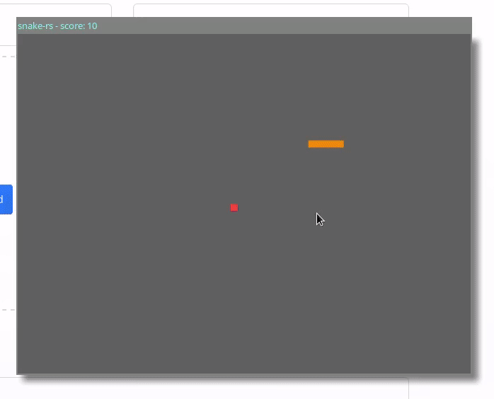

# snake-rs

[play online](http://snake.kirjava.xyz)

build for gtk

```shell
cargo run --bin gtk --features=gtk-deps
```

build for web

```shell
cargo +nightly web start --target wasm32-unknown-unknown --bin web --features web-deps
```

<div align="center">
    
</div>
